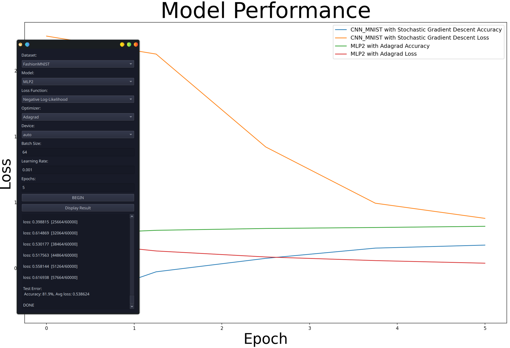

# Product Name

> My personal Pytorch NN trainer and tester

[](#)

A simple UI made in QT6 to simplify my experimentation of Pytorch models. Saves the hassle of changing train/test code and generate performance graphs to compare multiple models at once.



## Installation

Ensure you have all the required python packages in requirements.txt, then simply run:

```sh
python3 NeuralLearning.py
```

## Usage example

It's as easy as picking and choosing options from the dropdown menu and clicking on BEGIN. Each time you train a model, the results are automatically saved and ready to be graphed with the Display Result button. 

If you wish to use a GPU, ensure you have the revelent CUDA or ROCM drivers installed, and have the right pytorch package (pytorch-cuda or pytorch-rocm). Unfortunally AMD-Rocm support is really finicky and I had issues getting it working.

Eventually I intend to add a decicated folder where you can write Pytorch models. For now you'll have to ad models into the NN_models.py, then manually add it to the dropdown lists in app.py

## TODO

This is a list of future features and bug fixes that I intend to work on whenever I have the time. Be warned that I'm still a new developer and my code probably has some hidden bugs that needs to be worked on

- [ ] Move all models into a seperate directory. Python files for each kind of dataset
  
  - [ ] Automatically generate a list of all coded models and show them in the UI

- [ ] Add support for more datasets, loss functions, and optimizers

- [ ] Resolve some edge cases where Pytorch freaks out over input sizes

- [ ] Improving the GUI's readability and making it easier to use

- [ ] Fix this README cause I wrote it all in one go and really need an actual proof reader

## Release History

* 0.0.1
  * My first release, I'll try and remember to update this lol

## Meta

Visit me here – [My Website](https://madrobot9182.github.io/)

Currently not distributed under any license, I'll add one if this project gets more popular
